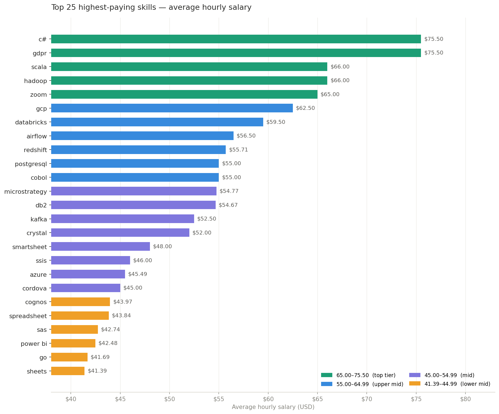
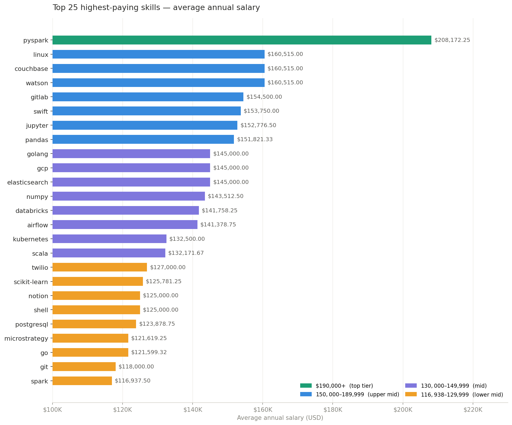
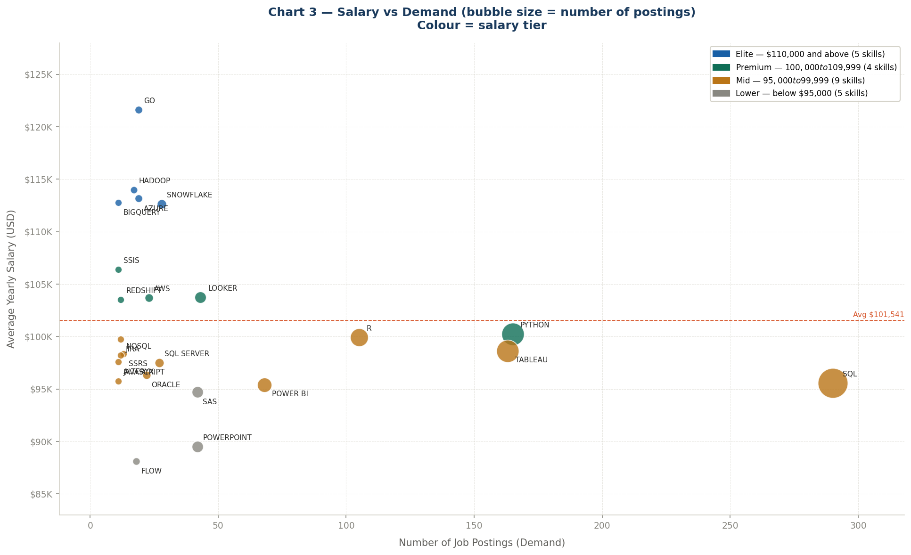
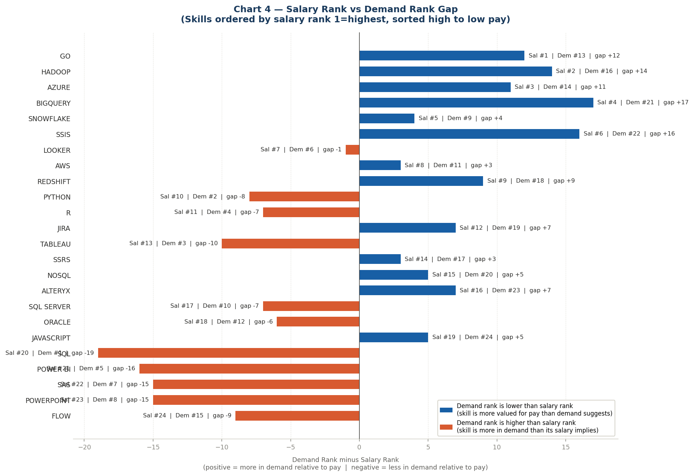

# 📊 Introduction
After completing my SQL course, I explored the data job market with a focus on data analyst roles. In this project, I used SQL to find the top-paying jobs, in-demand skills, and where high salary meets high demand.

The goal was simple - use real-world data to help cut through the noise and figure out what skills are actually worth learning and what jobs are worth chasing.

🔍 Curious about the queries? Check them out here: [project_sql_folder](/project_sql/)

---
# 🗂️ Background
I took [Luke Barouse's SQL for Data Analysts Course](https://lukebarousse.com/sql) on YouTube and this project came out of it. The goal wasn't just to practice SQL - it was to answer real questions about the data analyst job market.

Questions like:
- What skills pay the most?
- What skills are actually in demand?
- Where do salary and demand meet?

The dataset comes straight from Luke's course and is built from real-world data job postings with details on job titles, salaries, locations, and required skills. I worked with his 2023 database for this project.

 The latest version is available on his site at [DataNerd.tech](https://datanerd.tech/).


---
# 🛠️ Tools I Used
For this project, I used a few key tools to explore and analyse the data job market:

- **SQL**: The main tool I used to query the database and find insights.
- **PostgreSQL**: Used to manage and work with the job posting database.
- **Visual Studio Code:** My main workspace for writing and running SQL queries.
- **Git & GitHub:** Used for version control, project organisation, and sharing my work.

---
# 📊 The Analysis
Each query in this project focused on a specific part of the data analyst job market. Here's how I approached each question.

---
## 1. Top Paying Data Analyst Jobs

To identify the highest-paying roles, I filtered data analyst positions by average yearly salary and focused on remote jobs with salary data available.

This query highlights some of the highest-paying opportunities in the field.

```sql
SELECT
    job_title,
    salary_year_avg AS annual_salary,
    name AS company,
    job_posted_date,
    job_schedule_type,
    job_country,
    job_location,
    job_health_insurance,
    job_via
FROM
    job_postings_fact AS JPC
LEFT JOIN
    company_dim AS companies ON companies.company_id = JPC.company_id
WHERE
    job_work_from_home IS TRUE
    AND job_title_short = 'Data Analyst'
    AND salary_year_avg IS NOT NULL
ORDER BY
    salary_year_avg DESC
LIMIT 10;
``` 

Here's the breakdown of the top-paying data analyst jobs in 2023:

- **Wide Salary Range:** Top 10 paying data analyst roles span from $184,000 to $650,000, showing strong salary potential in the field.
- **Diverse Employers:** Companies like SmartAsset, Meta, and AT&T appear here, showing that high-paying roles exist across different industries.
- **Job Title Variety:** Roles range from Data Analyst to Director of Analytics, showing how broad the field is.

Here’s what I found when I looked deeper into the data:

- **Salary Insight:** The Mantys role ($650,000) is a clear outlier - almost double the next highest (Meta at $336,500). It likely includes additional compensation or location-based adjustments. Without it, salaries fall into a tighter range between $184,000 and $336,500.

- **Health Insurance:** Only 4 out of 10 roles include health insurance - AT&T, SmartAsset (both listings), and Get It Recruit. Interestingly, the two highest-paying roles don’t include it.

- **Job Platforms:** Indeed appears the most with 3 postings, making it the most active platform in this group. LinkedIn follows with 2 postings, while the remaining platforms appear once each.


*Bar chart visualising the salaries for the top 10 paying data analyst roles; Claude generated this chart from my SQL query results.*


*Pie chart visualising the number of data analyst roles that offered health insurance; Claude generated this chart from my SQL query results.*


*Bar chart visualising the platforms where the top 10 paying data analyst jobs were posted; Claude generated this chart from my SQL query results.*

## 📌 Chart Guide

  - Green bars = health insurance included
  - Blue bars = health insurance not included

## 2. Skills Required for Top-Paying Jobs
To focus on the skills behind top-paying roles, I reused a smaller version of my first query using a CTE. In that part, I filtered for the top-paying remote data analyst jobs based on yearly salary.

Then, I joined that result with the skills tables to bring in the skill names and skill types connected to each role.

I didn’t include columns like `job_posted_date`, `job_schedule_type`, `job_country`, `job_location`, `job_health_insurance`, and `job_via` because the focus here was specifically on the skills tied to these jobs.

This query makes it easier to see which skills appear in high-paying data analyst roles.


``` sql
WITH top_paying_jobs AS (
    SELECT
        job_id,
        job_title,
        salary_year_avg AS annual_salary,
        name AS company
    FROM
        job_postings_fact AS JPC
    LEFT JOIN
        company_dim AS companies ON companies.company_id = JPC.company_id
    WHERE
        job_work_from_home IS TRUE
        AND job_title_short = 'Data Analyst'
        AND salary_year_avg IS NOT NULL
    ORDER BY
        salary_year_avg DESC
    LIMIT 10
)

SELECT
    top_paying_jobs.*, -- for all the columns in the query above '.'
    skills AS skills_name,
    type AS skills_type
FROM top_paying_jobs
INNER JOIN skills_job_dim AS SJD ON SJD.job_id = top_paying_jobs.job_id
INNER JOIN skills_dim AS skills ON skills.skill_id = SJD.skill_id
ORDER BY
    annual_salary DESC;
```
Although the query returned the top 10 highest-paying jobs, the skill analysis focused on the 8 roles where skill data was available. The top-paying skills shown below came from those 8 jobs.

### Top 10 Most In-Demand Skills


* **SQL and Python** appear in all 8 roles (8/8). These are the only skills required across every top-paying role in this dataset.

* **Tableau** appears in 6 out of 8 roles (75%), making it the most-used visualisation tool here.

* **R** appears in 4 out of 8 roles (50%), including roles from AT&T, Pinterest, Motional, and Get It Recruit.

* **Jira, Confluence, Atlassian, and Bitbucket** each appear in 3 roles (37.5%), mostly from Inclusively and Motional. These companies rely more on collaboration tools.

* **Pandas and Excel** also appear in 3 roles each (37.5%). This shows that both programming and spreadsheet tools are still widely used together.


---
### **Skill Type Breakdown** (67 Total Skill Entries Across 8 Roles)


* **Programming** is the largest group with 22 entries (32.8%). This mainly comes from SQL, Python, and R showing up across most roles.

* **Analyst tools** come next with 17 entries (25.4%). This includes Tableau, Excel, Power BI, PowerPoint, and SAP.

* **Cloud, Libraries, and Other** each have 8 entries (11.9%).
    * **Cloud**: Azure, AWS, Snowflake, Oracle, Databricks

    * **Libraries**: Pandas, NumPy, PySpark, Jupyter, Hadoop 

    * **Other**: Git, Bitbucket, Atlassian, GitLab, Jenkins, Flow

* **Async** is the smallest category with 4 entries (6.0%), mainly Jira and Confluence for collaboration and project tracking.

---

### **Skills Required per Role (Sorted by Salary)**


* **Director, Data Analyst (Hybrid) at Inclusively ($189,309)** requires the most skills - 14 in total across all categories. Even with that, it ranks 4th in salary.

* **Associate Director - Data Insights at AT&T ($255,830)** is the highest-paying role in this group and requires 13 skills.

* **ERM Data Analyst at - It Recruit ($184,000)** requires the fewest skills - just SQL, Python, and R.

* **Principal Data Analyst roles at SmartAsset ($186,000 and $205,000)** both require 9 skills and share nearly the same skill mix: SQL, Python, Go, Snowflake, Pandas, NumPy, Excel, Tableau, and GitLab.

* **Data Analyst, Marketing at Pinterest ($232,423)** and **Data Analyst at UCLA Healthcare ($217,000)** each require only 5 skills but still pay above $215,000.

This shows that more skills don’t always mean higher pay. Sometimes a smaller set of specialised skills is enough.

---
## 3. Top Demanded Job Skills
To find the most in-demand skills, I joined the job postings table with the skills tables to connect each role to its required skills.

I filtered for remote data analyst roles that include health insurance because I wanted to focus on flexible roles with benefits.

Then, I counted how often each skill appeared and limited the results to the top 5.

```sql
SELECT
    skills,
    COUNT(*) AS skill_demand
FROM job_postings_fact AS JPC
INNER JOIN skills_job_dim AS SJD ON SJD.job_id = JPC.job_id
INNER JOIN skills_dim AS skills ON skills.skill_id = SJD.skill_id
WHERE
    job_title_short = 'Data Analyst'
    AND job_work_from_home IS TRUE
    AND job_health_insurance IS TRUE
GROUP BY
    skills
ORDER BY
    skill_demand DESC
LIMIT 5;
```
---
### **Top 5 In-Demand Skills (Jobs with Health Insurance)**

| Skill   | Demand Count |
| ------- | ------------ |
| SQL     | 1,399        |
| Excel   | 977          |
| Tableau | 790          |
| Python  | 734          |
| R       | 496          |

---

### **Top 5 In-Demand Skills (Jobs with and without Health Insurance)**

| Skill    | Demand Count |
| -------- | ------------ |
| SQL      | 7,291        |
| Excel    | 4,611        |
| Python   | 4,330        |
| Tableau  | 3,745        |
| Power BI | 2,609        |

---

### **Top 5 Most Demanded Skills for Data Analyst Roles** 


These 5 skills appear a total of 4,396 times across remote data analyst job postings that include health insurance.

* **SQL - 1,399 listings (31.8%)**  
  SQL is the most in-demand skill by far. It makes up almost one-third of all demand and leads Excel by 422 listings. This shows that SQL is a core requirement for data analyst roles.

* **Excel - 977 listings (22.2%)**  
  Excel comes second and still appears heavily across job listings. It shows up in more than 1 out of every 5 postings, proving it remains a core business tool.

* **Tableau - 790 listings (18.0%)**    
  Tableau is the top visualization tool in this dataset, slightly ahead of Python. Most of these roles are from the U.S., so this could reflect regional preference.

* **Python - 734 listings (16.7%)**  
  Python comes close to Tableau. Its demand comes from automation, analysis, and data handling tasks.

* **R - 496 listings (11.3%)**  
  Its demand comes from automation, analysis, and data handling tasks.

### **Key Takeaway**
SQL and Excel stand out the most and together make up over half of the total demand. Tableau and Python follow next, while R appears less frequently.

For me, this shows that starting with SQL and Excel makes the most sense before building into tools like Tableau and Python.

---
## 4. Top Paying Skills
To find the highest-paying skills, I joined the job postings table with the skills tables to connect each skill to salary data.

I filtered for remote data analyst roles with health insurance and salary information available.

Then, I calculated the average yearly and hourly salary for each skill and sorted them to find the top-paying ones.

These queries show which skills are linked to higher salaries in data analyst roles.

```sql
-- top 25 highest yearly-paying Data Analyst skills
SELECT
    skills AS skill_name,
    ROUND(AVG(salary_year_avg), 2) AS avg_annual_salary
FROM skills_job_dim AS SJD
INNER JOIN job_postings_fact AS JPC ON JPC.job_id = SJD.job_id
INNER JOIN skills_dim AS skills ON skills.skill_id = SJD.skill_id
WHERE
    job_title_short = 'Data Analyst'
    AND salary_year_avg IS NOT NULL
    AND job_work_from_home IS TRUE
    AND job_health_insurance IS TRUE
GROUP BY
    skill_name
ORDER BY
    avg_annual_salary DESC
LIMIT 25;

-- top 25 highest hourly-paying Data Analyst skills
SELECT
    skills AS skill_name,
    ROUND(AVG(salary_hour_avg), 2) AS avg_hourly_salary
FROM skills_job_dim AS SJD
INNER JOIN job_postings_fact AS JPC ON JPC.job_id = SJD.job_id
INNER JOIN skills_dim AS skills ON skills.skill_id = SJD.skill_id
WHERE
    job_title_short = 'Data Analyst'
    AND salary_hour_avg IS NOT NULL
    AND job_work_from_home IS TRUE
    AND job_health_insurance IS TRUE
GROUP BY
    skill_name
ORDER BY
    avg_hourly_salary DESC
LIMIT 25;
```

---
### **Top 25 Highest-Paying Skills (Average Hourly Salary)**

| Skill         | Average Hourly Salary ($) |
| ------------- | ------------------------- |
| c#            | 75.50                     |
| gdpr          | 75.50                     |
| scala         | 66.00                     |
| hadoop        | 66.00                     |
| zoom          | 65.00                     |
| gcp           | 62.50                     |
| databricks    | 59.50                     |
| airflow       | 56.50                     |
| redshift      | 55.71                     |
| postgresql    | 55.00                     |
| cobol         | 55.00                     |
| microstrategy | 54.77                     |
| db2           | 54.67                     |
| kafka         | 52.50                     |
| crystal       | 52.00                     |
| smartsheet    | 48.00                     |
| ssis          | 46.00                     |
| azure         | 45.49                     |
| cordova       | 45.00                     |
| cognos        | 43.97                     |
| spreadsheet   | 43.84                     |
| sas           | 42.74                     |
| power bi      | 42.48                     |
| go            | 41.69                     |
| sheets        | 41.39                     |

---

### **Top 25 Highest-Paying Skills (Hourly Salary)**



* **C#** and **GDPR** lead at $75.50/hr. These are more specialised skills, which likely explains the higher pay.

* **Scala** and **Hadoop** follow at $66.00/hr, showing the value of big data skills.

* **Zoom** appears at $65.00/hr. This likely comes from senior-level roles where communication and coordination matter alongside technical skills.

* **GCP** stands out at $62.50/hr, much higher than **Azure** at $45.49/hr.

* **Databricks** and **Airflow** also show strong pay, pointing to demand for data engineering tools.

* Tools like **PostgreSQL**, **Redshift**, and even **COBOL** remain valuable around the $55/hr range.

* Lower in the chart are tools like **Power BI**, **Spreadsheet**, and **SAS**, which are more common and therefore less specialised.

---

### **Top 25 Highest-Paying Skills (Average Annual Salary)**

| Skill         | Average Annual Salary ($) |
| ------------- | ------------------------- |
| pyspark       | 208,172.25                |
| linux         | 160,515.00                |
| couchbase     | 160,515.00                |
| watson        | 160,515.00                |
| gitlab        | 154,500.00                |
| swift         | 153,750.00                |
| jupyter       | 152,776.50                |
| pandas        | 151,821.33                |
| golang        | 145,000.00                |
| gcp           | 145,000.00                |
| elasticsearch | 145,000.00                |
| numpy         | 143,512.50                |
| databricks    | 141,758.25                |
| airflow       | 141,378.75                |
| kubernetes    | 132,500.00                |
| scala         | 132,171.67                |
| twilio        | 127,000.00                |
| scikit-learn  | 125,781.25                |
| notion        | 125,000.00                |
| shell         | 125,000.00                |
| postgresql    | 123,878.75                |
| microstrategy | 121,619.25                |
| go            | 121,599.32                |
| git           | 118,000.00                |
| spark         | 116,937.50                |

---


### **Top 25 Highest-Paying Skills (Annual Salary)**



* **PySpark** stands out the most at over $208K, making it the only skill above $200K.

* **Linux**, **Couchbase**, and **Watson** follow around the $160K range, pointing to infrastructure, database, and AI-related work.

* Tools like **GitLab**, **Jupyter**, and **Pandas** also appear strongly in high-paying roles.

* In the middle range, **GCP**, **Databricks**, and **Airflow** continue to appear, staying consistent with the hourly salary chart.

* **Kubernetes** and **Scala** also show strong salaries tied to infrastructure and big data work.

* Even the lower end of this chart still sits above $116K, showing strong overall pay across these skills.

---

### **What I Noticed (Hourly vs Annual)**

* **GCP**, **Databricks**, and **Airflow** appear strongly in both charts, making them reliable high-value skills.

* **PostgreSQL** and **MicroStrategy** rank better hourly than yearly, suggesting they may be more common in contract roles.

* **Scala** ranks very high hourly but more mid-range yearly, which could point to stronger contract-based pay.

* Some tools also appear alongside higher-level responsibilities. That’s why something like **Zoom** can appear with strong pay — it likely comes from senior or leadership-heavy roles rather than being valuable on its own.

Overall, some skills stay strong across both pay types, while others depend more on the structure of the role.

---

## 5. Optimal Skills
To find the most optimal skills to learn, I combined salary and demand into one query.

I joined the job postings table with the skills tables to connect each skill to both how often it appears and how much it pays.

I filtered for remote data analyst roles with health insurance and salary data available because I wanted to focus on flexible roles with clear compensation and benefits.

Then, I counted skill demand and calculated the average yearly salary for each skill.

I also filtered out skills that appeared fewer than 10 times to keep the results relevant.

This query highlights skills that balance both demand and salary


```sql
SELECT
    skills.skill_id,
    skills.skills,
    COUNT(*) AS demand_count, -- COUNT(SJD.job_id) and COUNT(JPC.job_id) also work perfectly when used in place of COUNT(*)
    ROUND(AVG(salary_year_avg), 2) AS avg_salary
FROM job_postings_fact AS JPC
INNER JOIN skills_job_dim AS SJD ON SJD.job_id = JPC.job_id
INNER JOIN skills_dim AS skills ON skills.skill_id = SJD.skill_id
WHERE
    job_title_short = 'Data Analyst'
    AND salary_year_avg IS NOT NULL
    AND job_work_from_home IS TRUE
    AND job_health_insurance IS TRUE
GROUP BY
    skills.skill_id
HAVING
    COUNT(*) > 10
ORDER BY
    avg_salary DESC,
    demand_count DESC
LIMIT 25; 
```
---
### **Skills - Demand and Average Salary**
| S/N | Skill      | Demand Count | Average Salary ($) |
| --- | ---------- | ------------ | ------------------ |
| 1   | go         | 19           | 121599.32          |
| 2   | hadoop     | 17           | 113989.03          |
| 3   | azure      | 19           | 113149.71          |
| 4   | bigquery   | 11           | 112772.73          |
| 5   | snowflake  | 28           | 112616.64          |
| 6   | ssis       | 11           | 106381.82          |
| 7   | looker     | 43           | 103732.19          |
| 8   | aws        | 23           | 103688.89          |
| 9   | redshift   | 12           | 103498.58          |
| 10  | python     | 165          | 100254.86          |
| 11  | r          | 105          | 99900.63           |
| 12  | jira       | 12           | 99754.08           |
| 13  | tableau    | 163          | 98607.77           |
| 14  | ssrs       | 13           | 98338.46           |
| 15  | nosql      | 12           | 98198.21           |
| 16  | alteryx    | 11           | 97601.36           |
| 17  | sql server | 27           | 97514.81           |
| 18  | oracle     | 22           | 96322.30           |
| 19  | javascript | 11           | 95740.00           |
| 20  | sql        | 290          | 95585.95           |
| 21  | power bi   | 68           | 95368.61           |
| 22  | sas        | 42           | 94716.35           |
| 23  | sas        | 42           | 94716.35           |
| 24  | powerpoint | 42           | 89515.80           |
| 25  | flow       | 18           | 88125.00           |

---
### **Salary - average pay by skill**

📊 **Chart 1 - Salary ranked high to low**


(Shows each skill’s average salary and demand. Colours group them by salary tier.)

* **Go** is the highest-paying skill with an average salary of $121,599, standing clearly above the rest.

* The top 5 skills — Go, Hadoop, Azure, BigQuery, and Snowflake — all have average salaries above $112K. Most of them are cloud or big data tools.

* There’s a noticeable drop after the top 5, with average salaries falling below $106K.

* At the lower end, **Flow** ($88K) and **PowerPoint** ($89K) have the lowest average salaries in this group.

* The full salary range is about $33K, from $88K to $121K. This shows how much skill choice can affect pay.

* The average salary across all listed skills is around $100K, with roughly half above and half below.

---

### **Demand - What Shows Up the Most**

📊 **Chart 2 - Demand ranked high to low**

(Shows how often each skill appears, using the same colour groups as salary chart.)

* **SQL** leads by a large margin with 290 postings, far ahead of every other skill.

* **Python** (165) and **Tableau** (163) follow closely behind.

* **R** comes next with 105 postings, followed by **Power BI** (68) and **Looker** (43).

* Most other skills appear far less frequently, usually between 11 and 28 postings.

---

### **Salary vs Demand - What Stood Out**

📊 **Chart 3 - Salary vs Demand (Bubble Chart)**

(Shows the relationship between salary and demand. Larger bubbles represent more postings.)

* **SQL** is the most in-demand skill but ranks lower in average salary. It’s expected across most analyst roles, so it doesn’t increase pay as much on its own.

* **Go** is the highest-paying skill but has relatively low demand. It’s more specialised and less common.

* **Python** stands out as one of the best-balanced skills, combining strong demand with strong pay.

* A good comparison is **Looker vs Power BI**:

  * Power BI has higher demand (68 vs 43)
  * But Looker has a higher average salary ($103K vs $95K)

---

### **Salary vs Demand Gap**

📊 **Chart 4 - Salary Rank vs Demand Rank Gap**

(Shows how far each skill is from matching its pay and demand.)

* **SQL** has the biggest gap - 1st in demand but 20th in salary.

* **Go** shows the opposite pattern - 1st in salary but much lower in demand.

* This makes it clear that high demand doesn’t always mean high pay.

---

### **Salary Groups (Average Salaries)**

* **$110K+ (Top Group):** Go, Hadoop, Azure, BigQuery, Snowflake

* **$100K–$109K:** SSIS, Looker, AWS, Redshift

* **$95K–$99K:** Python, R, Tableau, Jira, and others

* **Below $95K:** SQL, Power BI, SAS, PowerPoint, Flow

---

### **What This Shows**

Some skills pay more because they are rare and specialised, while others appear more often but offer lower average salaries.

For me, this shows that the best path is a mix of both:

* strong foundational skills like SQL
* and higher-value specialised tools that can increase salary potential

---

# 📚 What I Learnt
Throughout this project, I built practical skills from scratch and learned how to work with real-world data instead of just studying theory.

I went from not knowing SQL at all to being comfortable writing queries and solving real analytical problems.

* **Complex Query Writing**
  I learned how to write cleaner and more structured SQL queries using joins, CTEs, filtering, grouping, and ordering. I moved from basic queries to building multi-step analysis workflows.

* **Data Aggregation**
  I worked heavily with `COUNT`, `MAX`, `MIN`, `AVG`, and `GROUP BY` to break down large datasets into meaningful insights. This helped me understand patterns in skill demand and salary trends.

* **Analytical Thinking**
  I didn’t just run queries — I used them to answer real questions. Questions like:

  * what skills pay the most
  * what skills are most in demand
  * and where salary and demand overlap

  This helped me learn how to turn raw data into useful insights.

* **GitHub Skills**
  I learned how to structure projects, organise files, and present my work clearly on GitHub.

* **README Writing**
  I also improved at explaining technical work in a simple and clear way. Instead of only showing code, I focused on explaining the reasoning behind the analysis and the insights I found.

---

# 📌Conclusions
## 🔑 Key Insights

Here are the 5 biggest things I took away from this project:

1. **SQL and Excel are the baseline skills**
   They rank highly across both datasets (with and without health insurance), showing they are consistently expected in data analyst roles. This makes them the starting point for any data analyst path.

2. **High demand doesn’t always mean high pay** 
    SQL has the highest demand but sits lower in average salary, while specialised tools like Go and Hadoop pay more despite appearing less often. This shows that common skills get you in, but rare skills increase your pay.

3. **Top-paying roles don’t always need more skills** 
    Some jobs with only 5 required skills still pay more than jobs needing 14 skills. This shows that learning the right skills matters more than learning everything.

4. **Cloud and big data tools drive higher salaries** 
    Skills like Go, Hadoop, Azure, BigQuery, and Snowflake consistently appear in the highest-paying group.

5. **The best path is a mix of demand and pay** 
    Skills like Python and Tableau balance both strong demand and strong pay, making them valuable next steps after SQL and Excel.

---
## 💭 Closing Thoughts

Working on this project helped me see the data job market more clearly.
 
I didn’t just learn SQL - I learned how to use data to answer real questions and understand what actually matters in the industry.

One thing that stood out to me is that the market rewards both:

* strong foundational skills
* and specialised technical skills

SQL and Excel help get your foot in the door, while tools like Python, cloud platforms, and big data technologies can increase your value and salary potential.

I also realised that more skills doesn’t always lead to better outcomes. What matters more is learning the right tools and understanding how they work together in real roles.

Overall, this project helped me move from simply learning tools to thinking more like a data analyst - asking better questions, breaking problems down, and turning data into clear insights.
